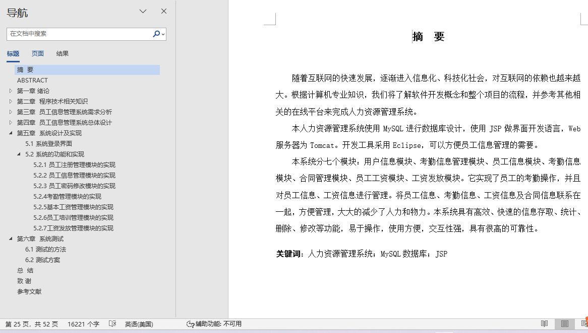
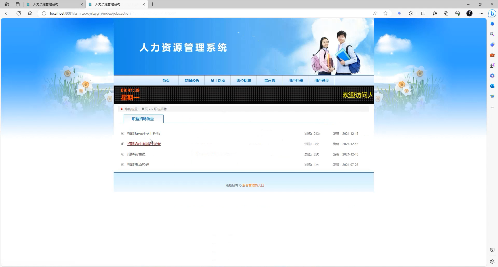
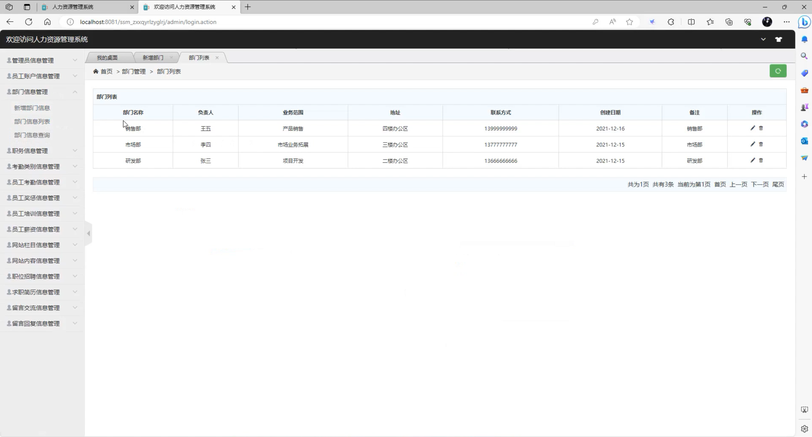
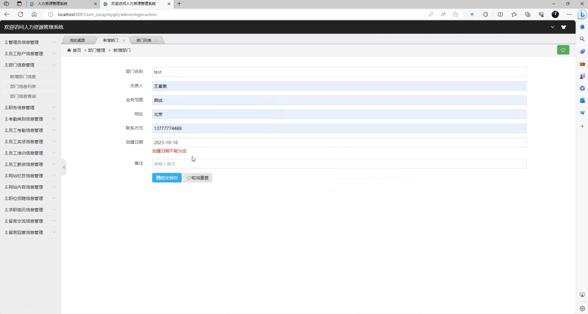
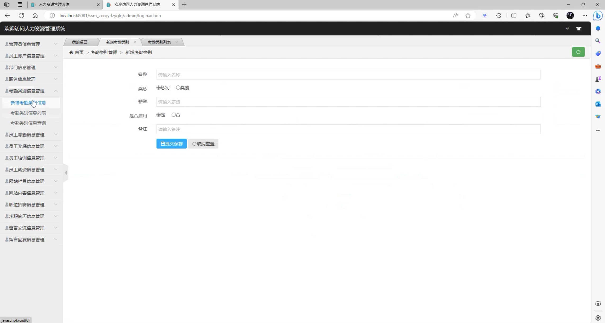
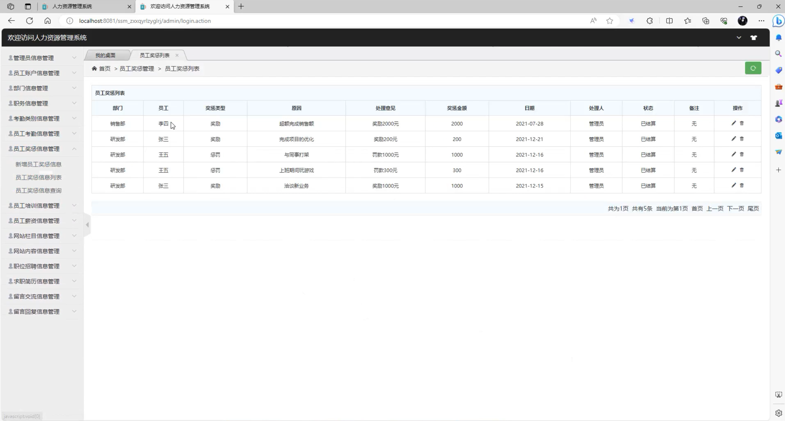
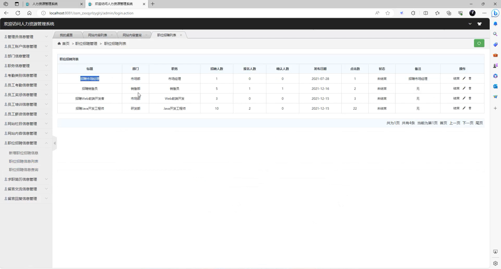
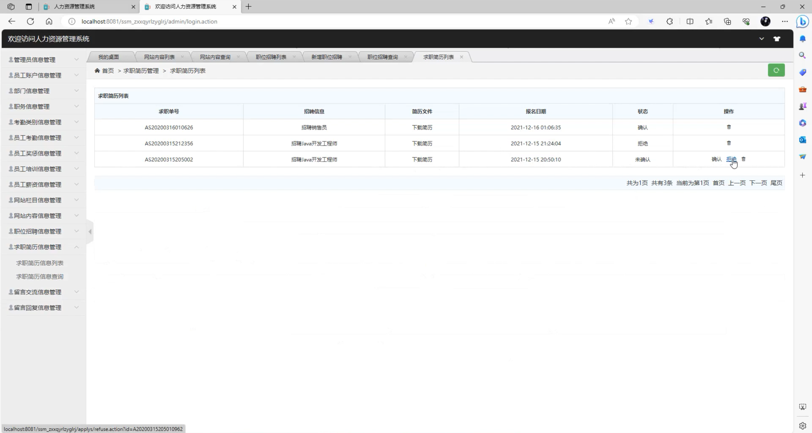

## 基于SSM实现的人力资源管理系统(程序+报告)

- <b>完整代码获取地址：从戎源码网 ([https://armycodes.com/](https://armycodes.com/))</b>
- <b>技术探讨、资料分享，请加QQ群：692619798</b> 
- <b>作者微信：19941326836  QQ：952045282</b> 
- <b>承接计算机毕业设计、Java毕业设计、Python毕业设计、深度学习、机器学习</b>
- <b>选题+开题报告+任务书+程序定制+安装调试+论文+答辩ppt 一条龙服务</b>
- <b>所有选题地址 ([https://github.com/YuLin-Coder/AllProjectCatalog](https://github.com/YuLin-Coder/AllProjectCatalog)) </b>

## 项目介绍
基于SSM实现的人力资源管理系统，该系统共包含两种角色：员工、管理员，主要分为前台和后台两大模块。
1.前台模块
前台首页、新闻公告、员工活动、职位招聘、留言板、用户注册、用户登录、个人中心、我的考勤、我的奖惩、我的培训、我的薪资、修改密码等功能。
2.后台模块
系统后台登陆、管理员管理、员工信息管理、部门管理、职务管理、考勤类别管理、员工考勤管理、员工奖惩管理、员工培训管理、员工薪资管理、网站栏目管理、网站内容管理、职位招聘管理、求职简历管理、留言交流管理、留言回复管理等功能。

## 项目技术
- 编程语言：Java
- 数据库：MySQL
- 前端技术：JSP、jQuery 、H-ui
- 后端技术：Spring、SpringMVC、MyBatis

## 运行环境
- JDK版本：JDK1.8及以上
- 开发工具：IDEA、Ecplise、Myecplise都可以
- 数据库: MySQL5.7及以上

## 运行截图

